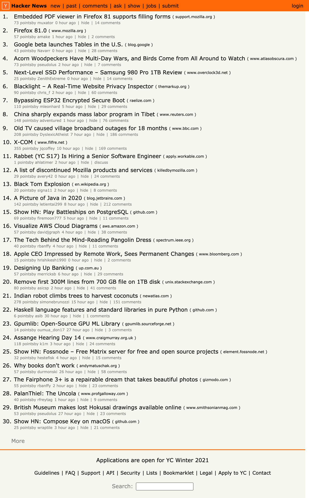
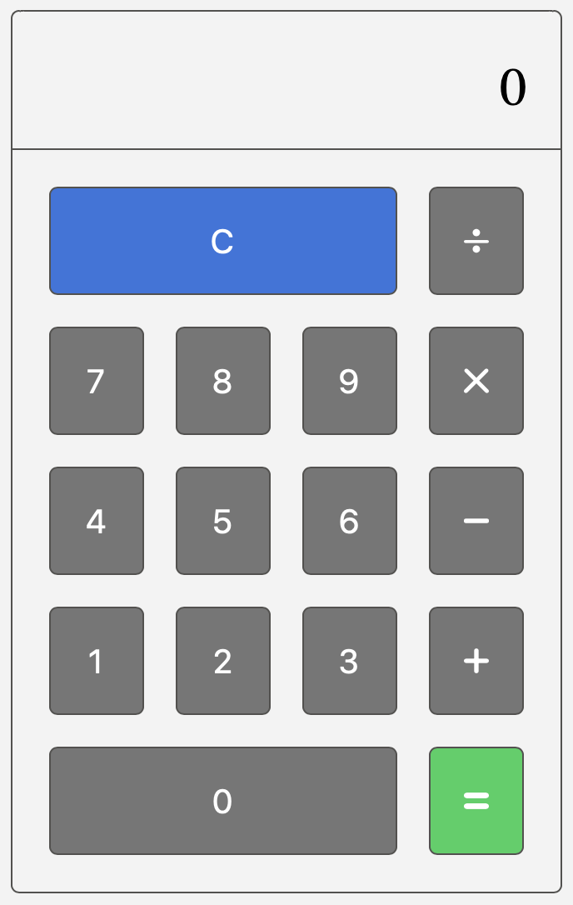
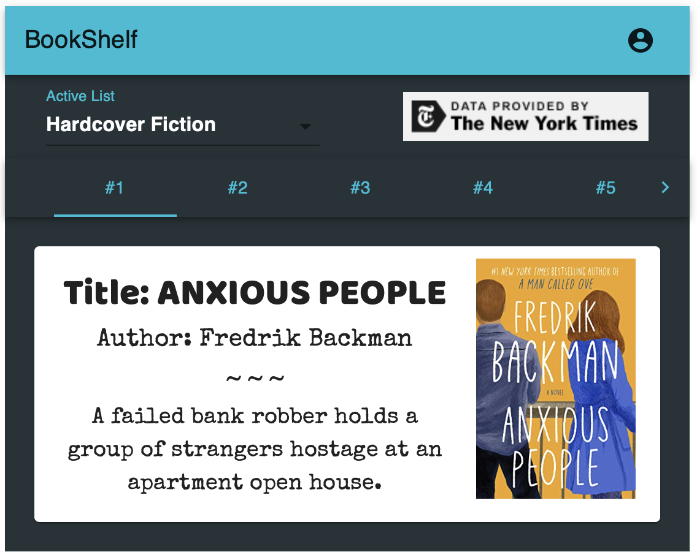
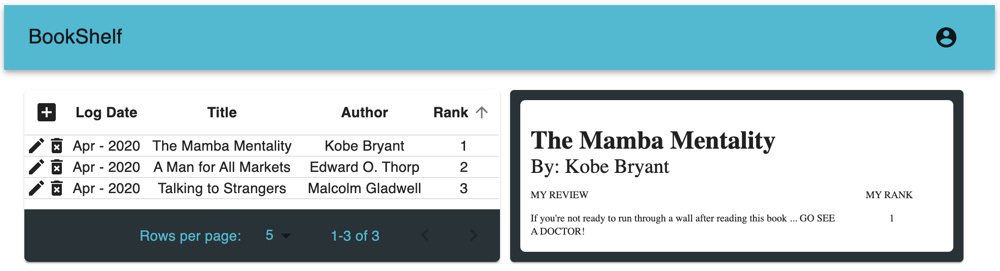
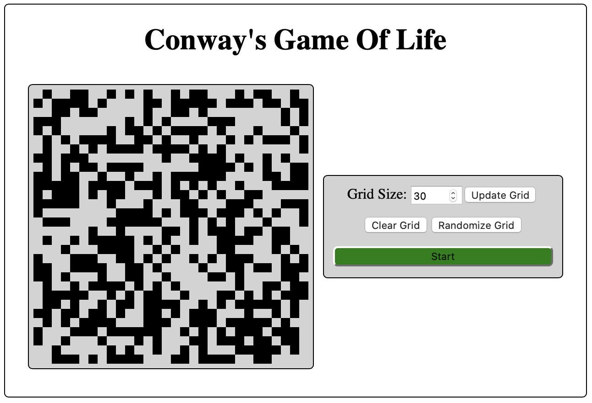

# Welcome to my profile! 👋

I am a recent graduate from [Lambda School's](https://lambdaschool.com) Full Stack [Web Development Program](https://lambdaschool.com) and am looking for my first position in the industry!

## Main Links

🖥 [Personal Website / Portfolio](https://reedturgeon.com)  
🔖 [Resume](https://docs.google.com/document/d/13DPm3TvQ_Lhh5_f97Rpcaa2kMh5tz9xogzhr38zkv9I/edit)

## Reach Out!

📱 508-446-6633  
📨 turgeon.dev@gmail.com

---

## What Have I Been Working On?

### 🧪 **Testing** 🧪

Specifically I am working to expand my skills with [React Testing Library](https://testing-library.com/docs/react-testing-library/intro) & [Mock Service Worker](https://mswjs.io)

### 🏋️ Recent Projects 🏋️

| Hacker News Clone                                                                                                                                | Most Bestest Calculator |
| :-:                                                                                                                                              | :-:                     |
| Main Goal: Expand testing capabilities with React Testing Library & Mock Service Worker                                                          | Main Goal: Expand testing capabilities with React Testing Library
| 🖥 [Live Link](https://turgeon-hackernews-clone.netlify.app/) 🖥 ⎢ 👨‍💻 [CodeBase](https://github.com/MrT3313/HackerNewsClone_TakeHomeChallenge2) 👨‍💻 | 🖥 [Live Link](https://most-bestest-calculator.netlify.app) 🖥 ⎢ 👨‍💻 [CodeBase](https://github.com/MrT3313/MostBestestCalculator_TakeHomeChallenge1) 👨‍💻 |
|                                                                                                |  |

---

### 🏗 Previous Projects 🏗
| BookShelf                                                                                                                            | Conways Game of Life |
| :-:                                                                                                                                  | :-:                  |
| Main Goal: Independently design & build a full RESTful Single Page Application                                                       | Main Goal: Practice simulation logic / generational algorithms |
| 🖥 [Live Link](https://my-book-shelf.netlify.app/login) 🖥  ⎢ 👨‍💻 [CodeBase](https://github.com/MrT3313/BookShelf) 👨‍💻                  | 🖥 [Live Link](https://turgeon-gameoflife.netlify.app) 🖥 ⎢ 👨‍💻 [CodeBase](https://github.com/MrT3313/GameOfLife) 👨‍💻 |
| 

   |  |
